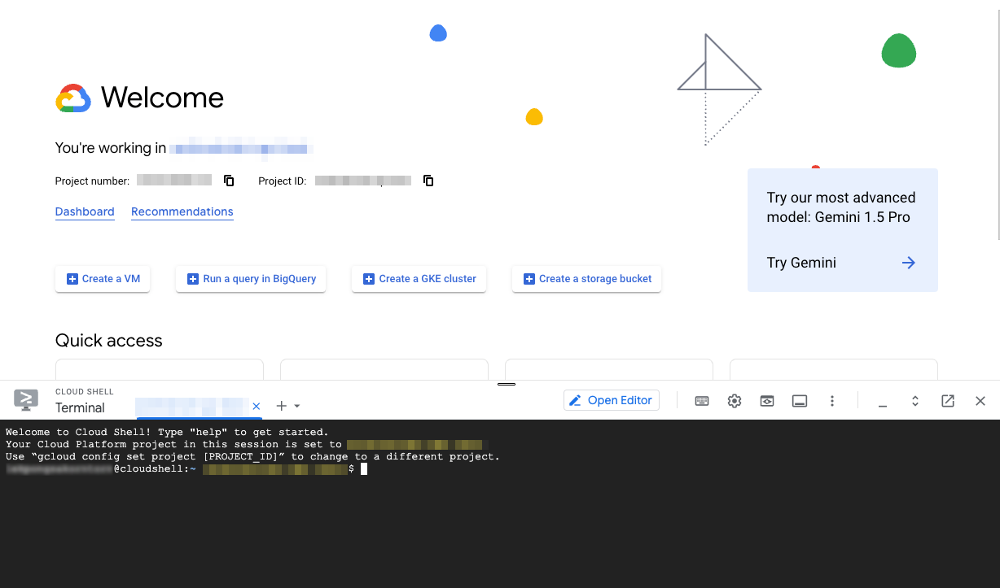
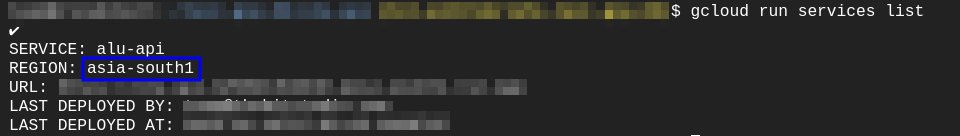
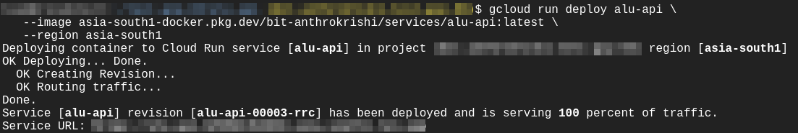

# API Update

To update the ALU API with the latest implementation, follow these steps:

1. Open a [Cloud Shell](https://cloud.google.com/shell/docs/launching-cloud-shell)
   in the GCP console.

   

1. Identify the region of the existing ALU API service.

   ```bash
   gcloud run services list
   ```

   

   > Example successful response

1. Redeploy the Cloud Run service. Replace YOUR_REGION with the region identified
   in the previous step.

   ```bash
   gcloud run deploy alu-api \
   --image asia-south1-docker.pkg.dev/bit-anthrokrishi/services/alu-api:latest \
   --region YOUR_REGION
   ```

   

   > Example successful response
