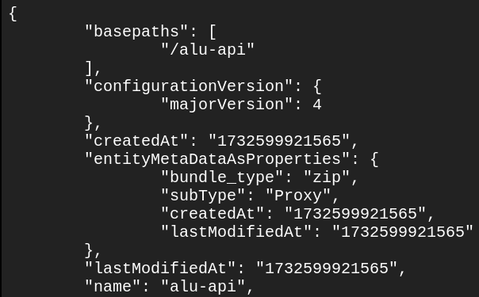
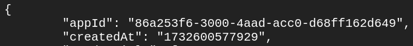

# ALU API | Customer Onboarding

## Prerequisites

Make sure you have GCP billing and project setup. Please use this [checklist](https://cloud.google.com/docs/enterprise/setup-checklist)
to enable and use all the necessary services.

## Deploy cloud services

1. Open a [Cloud Shell](https://cloud.google.com/shell/docs/launching-cloud-shell)
   in the GCP console.

   

1. Set environment variables to store your GCP project ID and enable needed service:

   ```bash
   PROJECT_ID="YOUR_GCP_PROJECT_ID"

   gcloud services enable cloudresourcemanager.googleapis.com --project $PROJECT_ID
   ```

1. Clone the alu-api repository from GitHub and make sure you are in the top-level
   directory of the Git repository:

   ```bash
   git clone https://github.com/google/alu-api && cd alu-api
   ```

1. Optionally, create a storage bucket and configure Terraform to store its state
   remotely for improved reliability and collaboration:

   ```bash
   gsutil mb "gs://$PROJECT_ID-tf"

   cat <<EOF >terraform/backend.tf
   terraform {
     backend "gcs" {
       bucket  = "$PROJECT_ID-tf"
       prefix  = "terraform/state"
     }
   }
   EOF
   ```

1. Initialize Terraform:

   ```bash
   terraform -chdir=terraform/ init
   ```

   

   > Example successful response

1. Optionally, preview the planned infrastructure changes:

   ```bash
   terraform -chdir=terraform/ plan -var="project_id=$PROJECT_ID"
   ```

1. Applies the planned infrastructure changes (It takes approximately 40 minutes):

   ```bash
   terraform -chdir=terraform/ apply -var="project_id=$PROJECT_ID" -auto-approve
   ```

   

   > Example successful response

1. Install and configure [apigeecli](https://github.com/apigee/apigeecli) tool:

   ```bash
   curl -L https://raw.githubusercontent.com/apigee/apigeecli/main/downloadLatest.sh | sh -
   export PATH=$PATH:$HOME/.apigeecli/bin
   apigeecli prefs set -o $PROJECT_ID
   ```

1. Update config files and create Apigee API proxy:

   ```bash
   CLOUD_RUN_URL=$(terraform -chdir=terraform/ output cloud_run_url | tr -d '"')
   sed -i "s|@CLOUD_RUN_URL@|$CLOUD_RUN_URL|" ./apiproxy/targets/default.xml

   apigeecli apis create bundle \
   --name="alu-api" \
   --proxy-folder="./apiproxy" \
   --metadata-token
   ```

   

   > Example successful response

1. Deploy Apigee API proxy (It takes approximately 3 minutes):

   ```bash
   APIGEE_PROXY_EMAIL=$(terraform -chdir=terraform/ output apigee_proxy_service_account_email | tr -d '"')

   apigeecli apis deploy \
   --name="alu-api" \
   --env="prod" \
   --sa="$APIGEE_PROXY_EMAIL" \
   --safedeploy \
   --sequencedrollout \
   --wait \
   --metadata-token
   ```

   

   > Example successful response

1. Set the following environment variables with your values:

   ```bash
   DEVELOPER_EMAIL="YOUR_EMAIL"
   DEVELOPER_FIRST_NAME="YOUR_FIRST_NAME"
   DEVELOPER_LAST_NAME="YOUR_LAST_NAME"
   DEVELOPER_USERNAME="YOUR_USERNAME"
   ```

1. Create an Apigee developer account:

   ```bash
   apigeecli developers create \
   --email=$DEVELOPER_EMAIL \
   --first=$DEVELOPER_FIRST_NAME \
   --last=$DEVELOPER_LAST_NAME \
   --user=$DEVELOPER_USERNAME \
   --metadata-token
   ```

   

   > Example successful response

1. Create an Apigee API Product:

   ```bash
   apigeecli products create \
   --name="alu-api" \
   --display-name="alu-api" \
   --opgrp="./apiproduct-op-group.json" \
   --envs="prod" \
   --approval="auto" \
   --attrs="access=public" \
   --metadata-token
   ```

   

   > Example successful response

1. Create an Apigee App and credential:

   ```bash
   apigeecli apps create \
   --name="alu-api" \
   --email=$DEVELOPER_EMAIL \
   --metadata-token

   API_KEY=$(apigeecli apps get --name="alu-api" --metadata-token | jq '.[0].credentials[0].consumerKey' | tr -d '"')

   apigeecli apps keys update \
   --name="alu-api" \
   --dev=$DEVELOPER_EMAIL \
   --key=$API_KEY \
   --prods="alu-api" \
   --metadata-token
   ```

   
   

   > Example successful responses

## Test the deployment

To get the base URL of the API, run the following commands.

```bash
API_HOSTNAME=$(terraform -chdir=terraform/ output apigee_hostname | tr -d '"')
API_BASE_URL="https://$API_HOSTNAME/alu-api"
echo $API_BASE_URL
```

To get the API key, run the following commands.

```bash
API_KEY=$(apigeecli apps get --name="alu-api" --metadata-token | jq '.[0].credentials[0].consumerKey' | tr -d '"')
echo $API_KEY
```

To test the API, run the below command. For now, you should get an error response
since you do not have access to the database. To get the access, please follow the
steps in the [Submit your GCP IDs](#submit-your-gcp-ids) section.

```bash
curl -i "$API_BASE_URL/v1/get-landscape?s2cell=4316826463333515264&apikey=$API_KEY"
```


> Example error response

Once you have access, try running the command again and you should get a successful
response like the one in the [API spec](https://agri.withgoogle.com/developer/apispec/).

## Submit your GCP IDs

### GCP organization ID

The organization resource ID is a unique identifier for an organization resource
and is automatically created when your organization resource is created. Organization
resource IDs are formatted as decimal numbers, and cannot have leading zeros.

You can get your organization resource ID using the Google Cloud console,
the gcloud CLI, or the Cloud Resource Manager API. ([see more](https://cloud.google.com/resource-manager/docs/creating-managing-organization#retrieving_your_organization_id))

### GCP project ID

A project ID is a unique string used to differentiate your project from all others
in Google Cloud. After you enter a project name, the Google Cloud console generates
a unique project ID that can be a combination of letters, numbers, and hyphens.

Go to the [Dashboard page](https://console.cloud.google.com/home) in the Google Cloud
console to get your project ID.


> Project info card on the Dashboard page

### Submission form

The customer is required to send a GCP organization ID and a GCP project ID to
the Google Team. The Google team will add the customer's organization ID to the
allow list and give the data access permission to the Service Account in the customer's
project.

Please submit your IDs via this [Google Form](https://docs.google.com/forms/d/e/1FAIpQLSeR2h9pdsXyE31ifIjcX_UZ0YidLMNi9_0sxFL2Q1tSHRHlNQ/viewform?usp=header).
